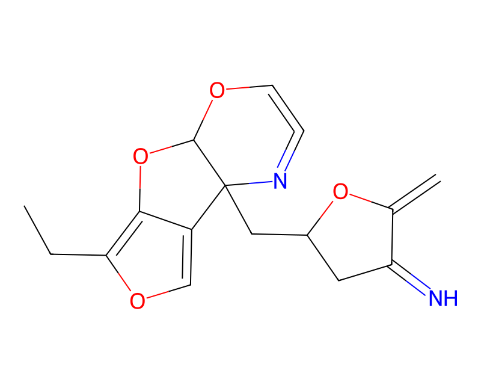
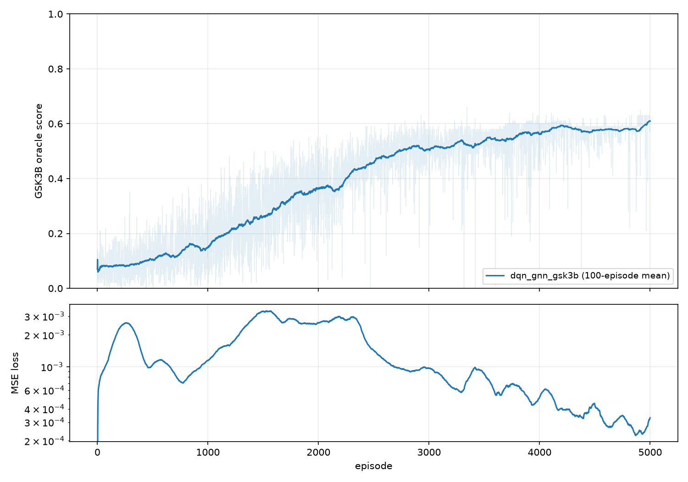
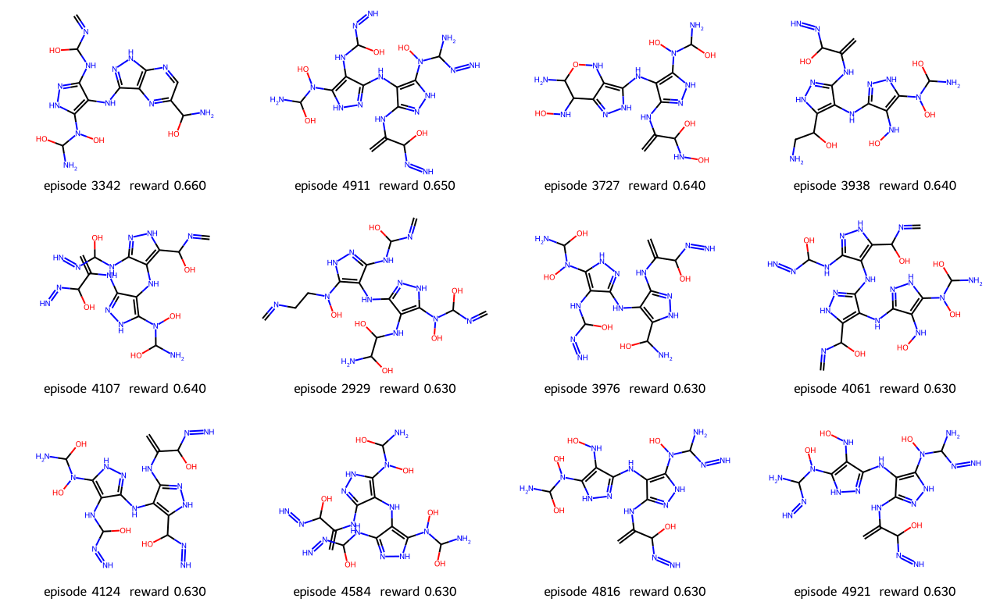
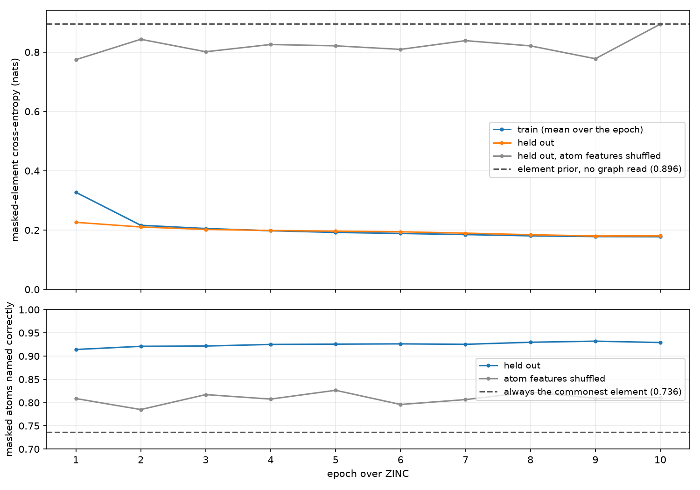
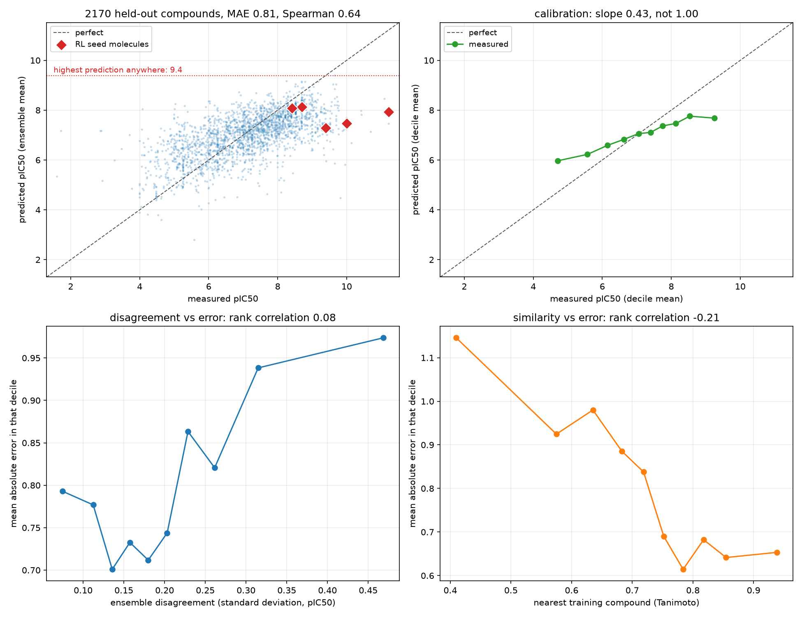
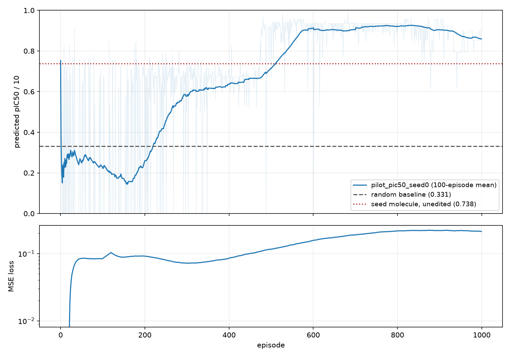

# Results

Every figure this project has produced, in build order. The numbers beside each one are
from the run that drew it — see [plan.md](../plan.md) for how each was measured and what
went wrong.

These are copies. Runs write into `runs/`, which is not tracked, because the CSV logs and
the 21 MB checkpoints beside them are regenerable and the plots are the part worth
reading.

## Step 1 — MolDQN on QED, fingerprint encoder

DQN **0.895** final mean terminal QED against random **0.145**, 5000 episodes at seed 0.

Two configurations, both fingerprint+MLP. The upper line is the published
`bootstrap_dqn.json` config (0.894); the lower is `MolDQN-pytorch/hyp.py`'s defaults
(0.707). The 0.19 gap is five differences, of which double discounting is the largest —
gamma 0.95 on top of an environment that already discounts by steps remaining.

The best single molecule of that run, QED 0.931. Fused strained heterocycles, an enol
ether, an exocyclic imine. QED scores descriptors and has no term for strain or
synthesizability, so an agent free to build any graph one atom at a time finds the corner
where it peaks. This is the result that motivates the fragment vocabulary.

## Step 2 — GNN encoder

GNN **0.896** against the fingerprint baseline's **0.895**, with 56k parameters against
2.7M.

The means are a tie — 0.001 apart is noise. The difference is spread: over the last 500
episodes the GNN's per-episode standard deviation is 0.047 against 0.087, and 0.4% of its
episodes fall below 0.5 against 1.2%. It is also narrower, 302 distinct molecules against
353. Steadier and more mode-collapsed are the same fact.

Top 12 of each run, GNN first. Still nonsense, and one aminooxazole motif repeats across
most of the GNN's twelve.

## Step 3 — TDC's GSK3β oracle

DQN **0.610** final mean against a random floor of **0.077**, best single molecule 0.66 at
28 heavy atoms, 7653 s.

The curve climbs the whole way: 0.090 over the first 500 episodes, 0.413 over episodes
2000–2500, 0.584 over the last 500. For scale, 3000 ZINC molecules average 0.029 on this
oracle and the best of the 3000 scores 0.51.

All 12 share one core: two or three aminopyrazoles joined by NH bridges. Aminopyrazoles
really do hinge-bind, so the oracle is not being fooled by noise — it is being fooled by a
real motif repeated past the point of plausibility. How it gets gamed is the finding.

## Step 3b — Masked-atom pretraining on ZINC

Held-out masked-element cross-entropy **0.181** against a marginal prior of **0.896**;
accuracy **0.929** against 0.736. 249,455 molecules, 10 epochs, 409 s.

The grey line is the control: the same molecules with the same atoms masked, atom features
dealt out to random positions. Its loss sits at the prior, so the task depends on the
neighbourhood. One pass does most of the work — held-out loss is 0.226 after epoch 1 and
0.181 after epoch 10.

Frozen linear probes on this checkpoint say the representation got *worse* on six of seven
RDKit properties. Fine-tuning says the initialization got better. Both were measured, they
disagree, and Step 4 settles it on real data.

## Step 4 — BindingDB EGFR pIC50 regressor

10,850 compounds, scaffold split, five-network ensemble. Test MAE **0.806**, RMSE
**1.052**, Spearman **0.642** — against 0.868 / 1.117 / 0.582 from a randomly initialized
encoder, and 1.138 from predicting the training mean.

Top left: predictions compress into 6–8.5 while measurements run 2–11, and the highest
prediction anywhere is 9.4. Top right is the same fact as a calibration slope of 0.43.
The bottom two panels test the guardrails Step 5 leans on: ensemble disagreement barely
predicts error (rank correlation 0.08), while Tanimoto similarity to the nearest training
compound does (−0.21). Similarity is the usable one.

Read the 0.806 next to 0.28, the half-width of a typical repeated label in this dataset,
not next to zero. Among compounds measured more than once the median spread is 0.56 log
units and 822 of 2,709 disagree by more than a log.

**This answers Step 3b's question on measured data: pretraining helps.** Every member of
the pretrained ensemble beat every member of the other on validation.

The eight test compounds the regressor ranks highest, predicted against measured. The
ranking is the property Step 5 actually depends on.

## Step 5 — pIC50 as the reward (pilot)

A pilot, not the deliverable: one seed, 1000 episodes, 6 edits, 292 s.

Three lines, and the order matters. Random at the same budget is **0.331**. The seed
handed back untouched is **0.738** — what the agent collects for taking the no-op every
step. The DQN reaches **0.859** over the last 100 episodes and peaks at 0.925 near episode
800. It crosses the no-op line around episode 510 and stays above it, so it is finding
edits the regressor scores above the lead rather than learning to sit still.

Two things in the curve worth naming. The first 180 episodes run *below* random, down to
0.15: epsilon is near 1.0 and the agent has not learned to stay inside the domain, so most
episodes end at zero. And the MSE loss climbs from 0.07 to 0.30 rather than falling,
because the reward the agent reaches keeps growing and the TD targets grow with it. It
flattens after episode 800; a loss that kept climbing would be the thing to chase.

Best single molecule 0.995 — predicted pIC50 9.95 at 24 heavy atoms, from a seed measured
at 10.00 and predicted at 7.38. The agent games the regressor again, and this time the
molecule looks plausible, which is the harder problem.

Re-running the command reproduced this run exactly — same final mean, same best molecule,
same graph hash.
