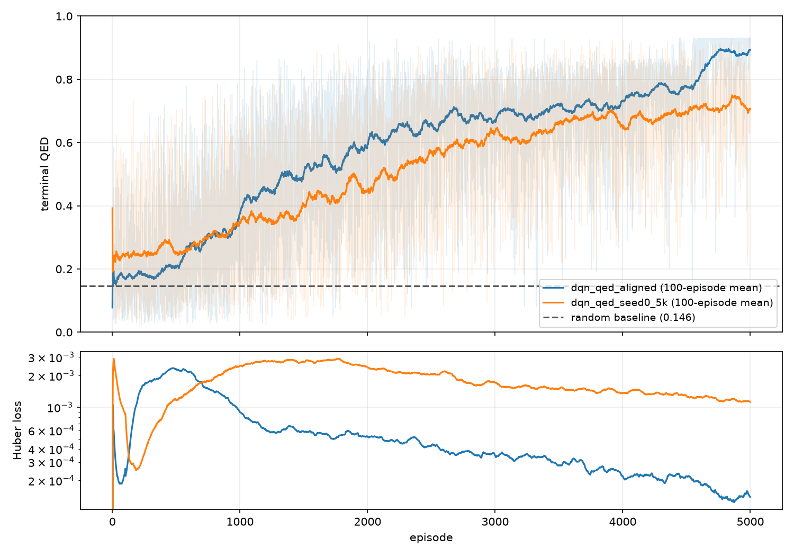
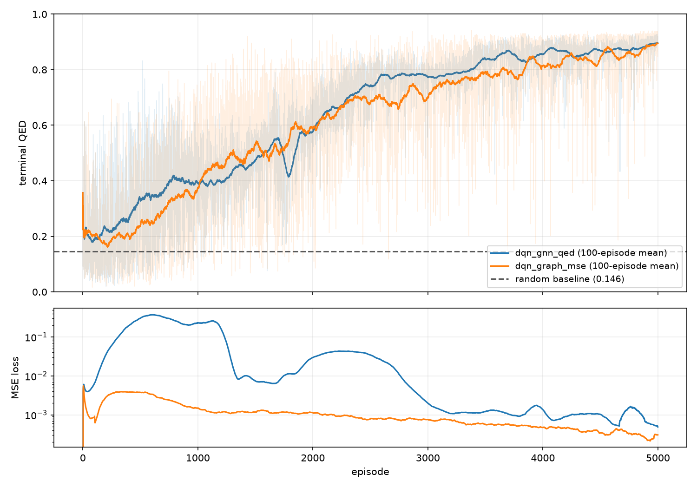
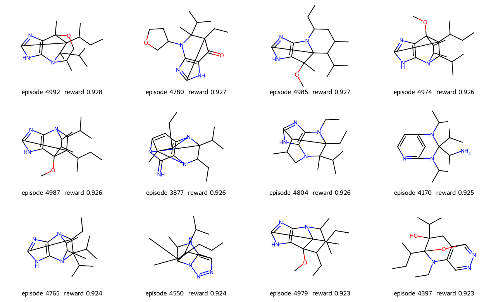
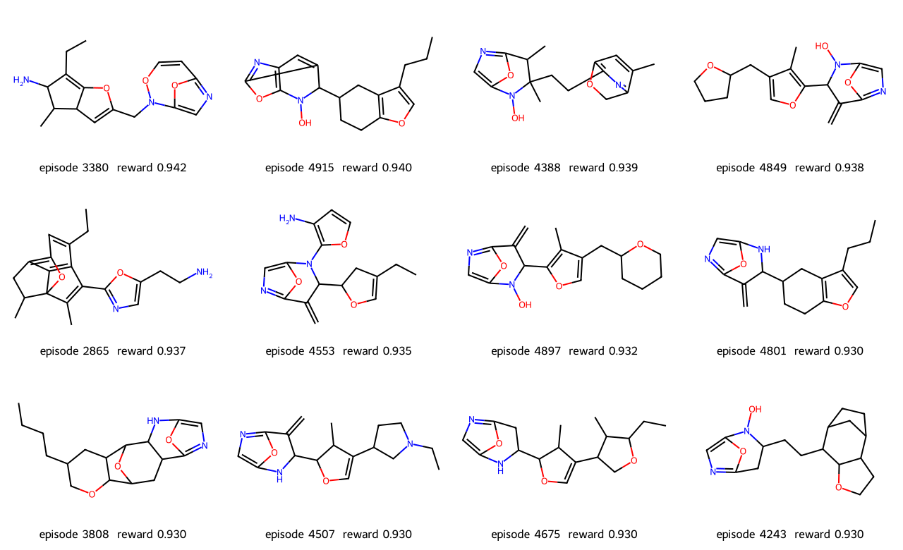
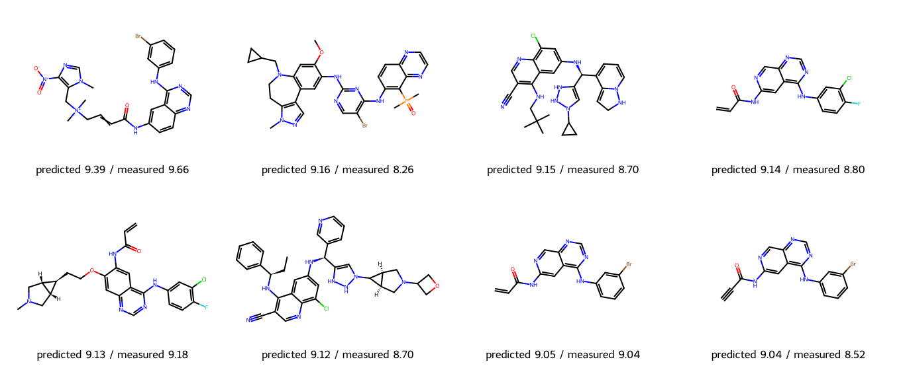
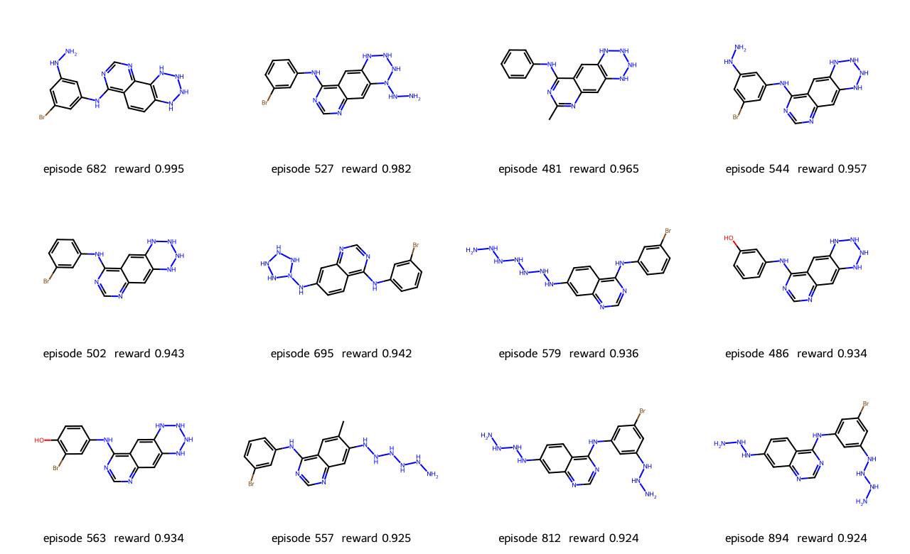

# Results

Every figure this project has produced, in the order the pipeline runs: the control
first, then the encoder, then the reward model, then the agent. The numbers beside each
one are from the run that drew it, and the text says what was measured and what went
wrong.

[`report.md`](report.md) beside this file is the generated companion: the same runs as
tables, with predicted pIC50 against each seed's own measured value and the audit columns
next to them. This file is the prose; that one is the numbers, and it is rewritten by
`python -m mol_optim.report` rather than by hand.

The figures are written here directly by the plotting steps. Runs write into `runs/`,
which is not tracked, because the CSV logs and the 21 MB checkpoints beside them are
regenerable and the plots are the part worth reading.

## The QED control

QED is RDKit's drug-likeness score: a weighted combination of eight molecular descriptors,
computed in microseconds, with no term for whether a structure can exist. It is here as
the control. An agent that games it does so visibly, which is what makes the same
behaviour against a fitted model believable later.

DQN **0.895** final mean terminal QED against random **0.145**, 5000 episodes at seed 0.



Two configurations, both fingerprint+MLP. The upper line is the published
`bootstrap_dqn.json` config (0.894); the lower is `MolDQN-pytorch/hyp.py`'s defaults
(0.707). The 0.19 gap is five differences, of which double discounting is the largest —
gamma 0.95 on top of an environment that already discounts by steps remaining.


The best single molecule of that run, QED 0.931. Fused strained heterocycles, an enol
ether, an exocyclic imine. QED scores descriptors and has no term for strain or
synthesizability, so an agent free to build any graph one atom at a time finds the corner
where it peaks. This is the result that motivates the fragment vocabulary.

## Choosing the encoder

Same reward, same MDP, two ways of turning a molecular graph into a vector: a Morgan
fingerprint into an MLP, or message passing over atoms and bonds. The GNN is the one that
carries forward, because it is the piece that can be pretrained.

GNN **0.896** against the fingerprint baseline's **0.895**, with 56k parameters against
2.7M.



The means are a tie — 0.001 apart is noise. The difference is spread: over the last 500
episodes the GNN's per-episode standard deviation is 0.047 against 0.087, and 0.4% of its
episodes fall below 0.5 against 1.2%. It is also narrower, 302 distinct molecules against
353. Steadier and more mode-collapsed are the same fact.




Top 12 of each run, GNN first. Still nonsense, and one aminooxazole motif repeats across
most of the GNN's twelve.

## Pretraining the encoder on ZINC

Held-out masked-element cross-entropy **0.181** against a marginal prior of **0.896**;
accuracy **0.929** against 0.736. 249,455 molecules, 10 epochs, 409 s.


The grey line is the control: the same molecules with the same atoms masked, atom features
dealt out to random positions. Its loss sits at the prior, so the task depends on the
neighbourhood. One pass does most of the work — held-out loss is 0.226 after epoch 1 and
0.181 after epoch 10.

Frozen linear probes on this checkpoint say the representation got *worse* on six of seven
RDKit properties. Fine-tuning says the initialization got better. Both were measured, they
disagree, and the regressor below settles it on real data.

## The EGFR pIC50 regressor

10,850 compounds, scaffold split, five-network ensemble. Test MAE **0.806**, RMSE
**1.052**, Spearman **0.642** — against 0.868 / 1.117 / 0.582 from a randomly initialized
encoder, and 1.138 from predicting the training mean.


Top left: predictions compress into 6–8.5 while measurements run 2–11, and the highest
prediction anywhere is 9.4. Top right is the same fact as a calibration slope of 0.43.
The bottom two panels test the guardrails the agent leans on: ensemble disagreement barely
predicts error (rank correlation 0.08), while Tanimoto similarity to the nearest training
compound does (−0.21). Similarity is the usable one.

Read the 0.806 next to 0.28, the half-width of a typical repeated label in this dataset,
not next to zero. Among compounds measured more than once the median spread is 0.56 log
units and 822 of 2,709 disagree by more than a log.

**This answers the pretraining question on measured data: pretraining helps.** Every
member of the pretrained ensemble beat every member of the other on validation.



The eight test compounds the regressor ranks highest, predicted against measured. The
ranking is the property the agent actually depends on.

## The agent against predicted pIC50

One seed scaffold of five, 1000 episodes, seed 0. Two episode budgets, 3 edits and 6.


Three lines, and the order matters. Random at the same budget is **0.331**. The seed handed
back untouched is **0.738** — what the agent collects for taking the no-op every step. The
DQN reaches **0.761** at 3 edits and **0.745** at 6, over the last 100 episodes.

That is the whole result, and it is a smaller one than it looks: the agent ends up roughly
where sitting still would put it. Over the last 100 episodes the 3-edit run beats the
untouched seed 74 times and the 6-edit run 44 times. The curve climbing from 0.15 to 0.75
is the agent learning to stay inside the regressor's applicability domain — 36 episodes of
1000 still end at zero at 3 edits, 107 at 6 — not learning to improve on the lead.

The MSE loss climbs rather than falls, from 0.07 to 0.28, because the reward the agent
reaches keeps growing and the TD targets grow with it.



Best single molecule 0.916 at 6 edits, 0.907 at 3 — predicted pIC50 9.16 and 9.07, from a
seed measured at 10.00 and predicted at 7.38. The drawing above is from the earlier
unreproducible run; the molecules differ, the conclusion does not.

Run the audit and the plausible-looking molecules stop looking plausible:

```bash
mol-optim configs/recheck.toml
```

At 6 edits 11 of the top 12 carry a nitrogen–nitrogen bond and 10 keep the seed's
scaffold; at 3 edits it is 7 of 12 with the scaffold intact in all 12. Against QED the
agent reached for strained rings; against a fitted model it reached for catenated
nitrogen. Same behaviour, and only one of them is visible without looking.

## What the agent recovers, and the honest-reward control

The reward curve is not the result. What is: of the **565 measured compounds on seed 0's
scaffold**, every one of them held out of the regressor's training set, how many did the
run actually build?

| run | reward | distinct | found | ≥8 | ≥9 |
|---|---|---:|---:|---:|---:|
| DQN, 3 edits | regressor | 318 | 8 | 2 | 1 |
| DQN, 6 edits | regressor | 437 | 7 | 1 | 0 |
| DQN, 3 edits | **measured** | 279 | **12** | **4** | 1 |
| DQN, 6 edits | **measured** | 328 | 9 | 1 | 0 |


The last two rows are the positive control, `configs/control.toml`: the same loop and the
same budget, rewarded by *measured* pIC50 through a lookup, so nothing is fitted and there
is nothing to game. It recovers 12 analogs of 565 against the fitted regressor's 8 — 2.1%
against 1.4% — and doubles the actives, 4 against 2.

**That is the number that reframes the project.** A reward that cannot be gamed at all,
given the same 1000 episodes, does not reach a different order of magnitude. Most of what
holds recovery near 2% is not the reward model. It is the search, the action space, or the
budget.

Read the control as a bound rather than a comparison: its reward is zero for every graph
BindingDB has no number for, so it gets no gradient toward an analog until it lands on one
exactly, and its curve (blue) spends 300 episodes at the floor because of it. A
better-shaped honest reward could beat 12. But the fitted regressor is dense and smooth
and still finds 8.

## A number that did not reproduce

An earlier run of the 6-edit configuration, logged 2026-08-20 and reported here as
**0.859** with a best molecule of 0.995, cannot be reproduced. The same configuration run
today gives 0.745 and a best of 0.916, four times over: twice on current code, once with
`OMP_NUM_THREADS=1`, and once from a worktree at 811e2ff, the commit that predates the
2026-08-20 run. All four agree bitwise. Every file that could move the number — the
environment, the reward, the featurization, the encoder, the Q-network, the replay buffer,
the seeding and the training loop — is unchanged between that commit and now.

So the 0.859 came from a working tree that was never committed, and it is gone. Nothing
above depends on it any more; the 0.745 that replaces it is weaker, and it is real.

Every run now writes `runs/<name>.json` beside its CSV — the resolved agent spec, the git
commit, and the torch, rdkit and numpy versions — so the next number that moves can be
traced instead of argued about.
